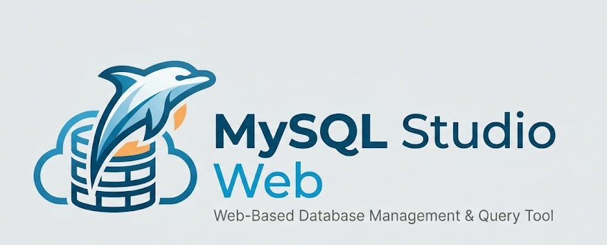

# MySQL Studio Web — Free Local Web MySQL Client

**MySQL Studio Web** is a lightweight, browser-based MySQL client and SQL studio for developers who want a fast DBeaver-style workflow without heavy desktop apps or a frontend build step. Run it locally, connect to remote MySQL servers, browse schemas, edit SQL, and export results — all from your browser.

**Keywords:** MySQL web client, online MySQL GUI, SQL editor, database studio, DBeaver alternative, Node.js MySQL tool, schema explorer, CSV export.

**Owner:** [Amrish Kakadiya](https://github.com/amrishkakadiya) · Credits in the app sidebar

---

## Why MySQL Studio Web?

- **Zero frontend SPA build** — Alpine.js, CodeMirror CDN; Tailwind via CLI (single CSS file, no Webpack/Vite)
- **Low footprint** — single Node process, pooled `mysql2` connections
- **Portable data** — copy the `data/` folder to move connections, scripts, and exports
- **One-command start** — `sh serve.sh` installs dependencies if needed and serves the app

---

## Features

### Connections & sessions

- Save multiple MySQL connection profiles (host, user, password, theme color)
- Test connections with PING before saving
- Open several sessions at once and switch without dropping others
- Optional keep-alive so idle pools stay warm

### Schema explorer

- Double sidebar: connections + per-connection schema tree
- Databases → folders for **Tables**, **Views**, **Procedures**, **Triggers**, **Events**
- Client-side search across object names
- Open table data or load procedure/trigger/event `CREATE` SQL into the editor

### Table data grid

- Paginated browsing with infinite scroll
- Server-side sort and prefix filter
- Adjustable rows-per-page (session override)
- Column / index / DDL inspector tabs

### SQL editor

- CodeMirror MySQL mode, multi-tab workspace
- Run statement under cursor (or selection) with ⌘/Ctrl+Enter
- Auto-LIMIT safety on SELECT when no limit is set
- Autocomplete from table/column schema
- Format SQL, query history, dark/light theme
- Saved scripts as real `.sql` files under `data/scripts/`

### Export

- Quick CSV/JSON download of loaded rows
- **Export…** for batched full-result exports to `data/exports/`
- One file or file-per-batch, custom names and subfolders
- Multi-file results listed in the export dialog with download links

### UX polish

- Resizable editor / results split
- Font settings for UI and editor
- Connection-colored tabs and accents
- Local + UTC clock; About / credits popup

---

## Quick start

```bash
sh serve.sh
```

1. Installs `node_modules` if missing  
2. Builds Tailwind CSS (`public/css/app.css`)  
3. Ensures `data/{config,exports,scripts}`  
4. Starts the HTTP server  

Open **http://localhost:3000** (or your configured port). Stop with `Ctrl+C`.

### Friendly hostname (optional)

```bash
sh serve.sh --setup-hosts
```

Maps `mysql-studio-web.local` → `127.0.0.1` in `/etc/hosts` (sudo once). Then use http://mysql-studio-web.local:3000

### Custom port / bind address

```bash
cp .env.example .env
# PORT=3000
# HOST=0.0.0.0
sh serve.sh
```

Or: `PORT=4000 sh serve.sh`

| Variable | Default   | Meaning                                     |
| -------- | --------- | ------------------------------------------- |
| `PORT`   | `3000`    | HTTP port                                   |
| `HOST`   | `0.0.0.0` | Bind address (`127.0.0.1` = localhost only) |

### npm

```bash
npm start
npm run setup-hosts
npm run build:css   # after HTML/JS class changes (also runs in serve.sh)
```

**Requirements:** Node.js 18+, npm

---

## Tech stack

| Layer        | Choice                                            |
| ------------ | ------------------------------------------------- |
| Server       | Node.js, Express                                  |
| MySQL        | `mysql2/promise` connection pools                 |
| Local config | `better-sqlite3` → `data/config/client_config.db` |
| UI           | Alpine.js, Tailwind CLI → `public/css/app.css`, CodeMirror CDN |

No React/Vue build pipeline. Designed for speed and simple deployment on a laptop or small VPS.

---

## Data layout

```
data/
  config/     SQLite (connections, history, settings) — sensitive
  scripts/    Saved SQL editor tabs
  exports/    Batched CSV/JSON exports
```

See [`data/README.md`](data/README.md). Never commit `client_config.db` (passwords) or export payloads.

---

## Security & git hygiene

Before pushing to GitHub:

- **Do commit:** source, `README.md`, `.env.example`, public assets
- **Never commit:**
  - `.env` (ports are fine to document; secrets are not)
  - `data/config/client_config.db*` (DB passwords)
  - GitHub tokens, API keys, PEM/private keys
  - `do_not_commit/`

`.gitignore` already blocks these patterns. Double-check with `git status` before the first push.

---

## License & credits

Built and maintained by **Amrish Kakadiya**.
